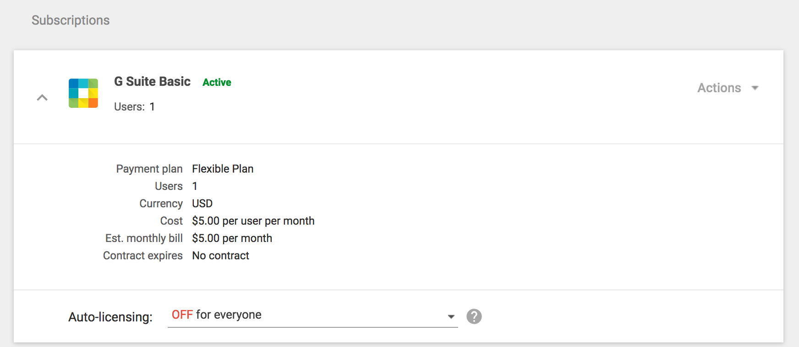
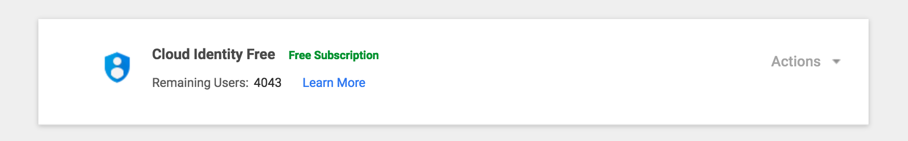
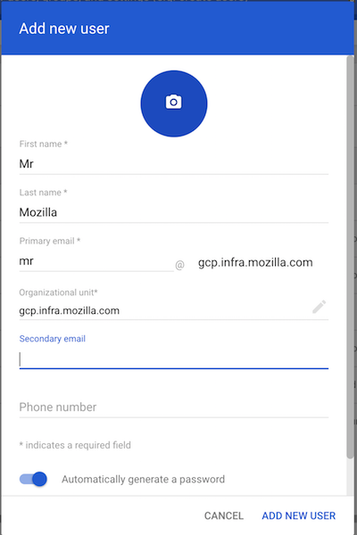
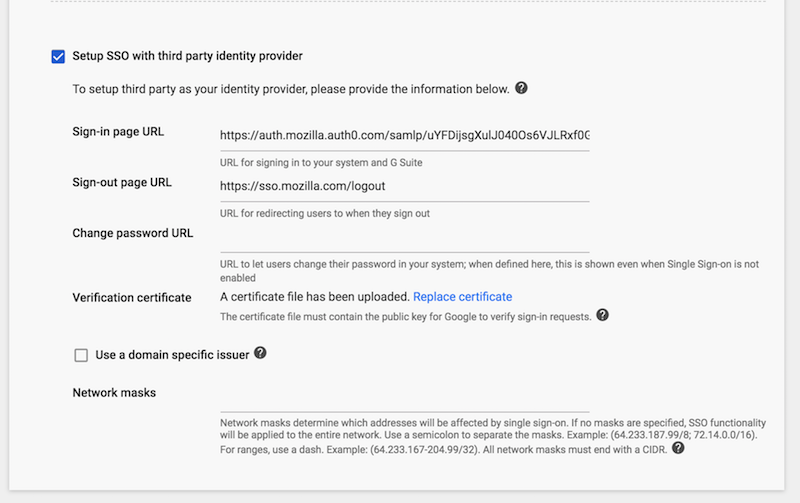

# Mozilla | GCP Infrastructure

---

# Introduction

Several departments within Mozilla have interest in running workloads on the Google Compute Platform (GCP). This document describes how the GCP accounts are setup and is based on the POC run with the Bedrock team (mozilla.org). This design is meant to limit the potential _blast radius_ of a single "super admin" compromise in GSuite by separating GCP from GSuite.  

## Goals

* The GCP environment should have 100% of regular users go through SSO to login.
* The GCP environment should have consolidated billing.
* Resources in the account should only be editable by delegated admins per cost center.
* Super Admins should still have an organization "break glass" access to perform incident response (security & operations alike).

## Technical Implementation

Mozilla currently uses GSuite (as in Drive, Docs, etc.) for several organizations.  The requirements above require an additional domain _gcp.infra.mozilla.com_ in order to ensure complete GSuite separation of super admins.  This was setup as a standalone GSuite domain with a single mailbox leveraging the _new_ Google Cloud Identity free tier for additional users.  

## URLs of Interest

These are the primary URls for Google Cloud Management. In both cases unless signing in as "super-admin" it will be best
to use the provider initiated signon URL.  As of today June 27, 2018 the provider initiated url is:

```
https://auth.mozilla.auth0.com/samlp/uYFDijsgXulJ040Os6VJLRxf0GG30OmC
```

> Note this url requires a `relayState` parameter. See relayState section below for more information on Google SAML flows.

* GSuite Admin Console  https://admin.google.com
* Google Cloud Admin https://cloud.google.com

> Point and click
```
https://auth.mozilla.auth0.com/samlp/uYFDijsgXulJ040Os6VJLRxf0GG30OmC?RelayState=https://console.cloud.google.com/

```

# How to setup the GCP environment

### Notes on GSuite vs GCP
A single mailbox GSuite domain exists for *gcp.infra.mozilla.com*. Due to the nature of the way the admin console works in GSuite Enterprise, things can be confusing. In order to create a GSuite domain that contains only a single licensed user two things need to happen: Turn off auto-licensing and enable Google Cloud Identity (Free Tier).

## How-to setup GSuite & GCP

### 1 - Disabling Auto Licensing

In the Gsuite Admin Console, navigate to billing. Select "G Suite Basic" and ensure Auto-Licensing is set to "Off for Everyone".



### 2 - Enable Google Cloud Identity (Free Tier)

In the Gsuite Admin Console, navigate to billing again. Enable "Google Cloud Identity (Free Tier)".

> Note that you may need to request a limit increase by calling Google. The default number of cloud identity seats is ~ 100 at the time of writing.  



This allow us (as admin) to add users to GSuite without them receiving licenses to use GSuite products. They are strictly principals that can be mapped to an SSO user using SAML Claims.

## User provisioning in GCP

### Create your first user manually (Cloud Users vs GSuite Mailboxes)

> Note, this is an optional step if you just want to test that users work
> 
In order to create a user without a license start in the GSuite Admin Console and navigate to "Directory => Users". Within users any user can be created so long as the username matches the Mozilla LDAP username (usually it's also their Mozilla email). As a standard we put the mozilla email as the users secondary email at present for all manually created users (e.g. jdoe@mozilla.com).



## Automatic user provisioning with Mozilla IAM (SSO)

> Note, this is the recommended way to setup provisioning.

Users can and should be automatically provisioned and de-provisioned by the SSO setup. Google cannot currently do this automatically for environments that do not solely rely on Active Directory. In other words, SCIM is not supported.

The alternative is to write a driver that will call Google's API in order to care for the provisioning and deprovisioning directly.

This is the Mozilla IAM driver: https://github.com/mozilla-iam/gsuite_cloud_users_driver

Follow the setup instructions from the repository to set the driver up. Once setup, users will be automatically add and removed as needed.

## Integration for SAML Based Authentication

### With Auth0
#### SAML Claim Mapping configuration
When using Auth0 as SSO/Access Provider you should use the following access map. It indicates which SAML claims Google understands and maps the Auth0 values to these claims. *An additional mapping is done with a rule in addition to this configuration (see below).*

> Note that the Application callback URL (ACS) in this case is:
> https://www.google.com/a/gcp.infra.mozilla.com/acs and should also be reflected in the configuration as "callback uri" when using Auth0


```
{
  "audience": "https://www.google.com/a/gcp.infra.mozilla.com/acs",
  "mappings": {
    "nickname": "http://schemas.xmlsoap.org/ws/2005/05/identity/claims/name"
  },
  "createUpnClaim": false,
  "passthroughClaimsWithNoMapping": false,
  "mapUnknownClaimsAsIs": false,
  "mapIdentities": false,
  "signatureAlgorithm": "rsa-sha256",
  "digestAlgorithm": "sha256",
  "lifetimeInSeconds": 86400,
  "signResponse": false,
  "nameIdentifierFormat": "urn:oasis:names:tc:SAML:2.0:nameid-format:email",
  "nameIdentifierProbes": [
    "http://schemas.xmlsoap.org/ws/2005/05/identity/claims/emailaddress"
  ],
  "authnContextClassRef": "urn:oasis:names:tc:SAML:2.0:ac:classes:unspecified"
}
```

> Tip: The audience changes per GSuite domain.

On the Google side the SAML setup points to the IDP initiated URL and receives the SAML certificate from Auth0.



#### SAML Claim mapping rule

Due to the fact users are signing into the GSuite domain `mozilla.com` (or other Mozilla staff domains) using the SSO flow we have to remap additional claims to make the users look like they belong to another domain `gcp.infra.mozilla.com`. This can be done with Auth0 rules. See the sample rule below:

``` nodejs
function (user, context, callback) {
  if (context.clientID !== 'uYFDijsgXulJ040Os6VJLRxf0GG30OmC') // GSuite `client_id` (mozilla.com)
    return callback(null, user, context);

  // Replace all known-staff domains
  user.myemail = user.email.replace("mozilla.com", "gcp.infra.mozilla.com").replace("mozillafoundation.org", "gcp.infra.mozilla.com").replace("getpocket.com", "gcp.infra.mozilla.com");

  context.samlConfiguration = context.samlConfiguration || {};

  context.samlConfiguration.mappings = {
     "http://schemas.xmlsoap.org/ws/2005/05/identity/claims/nameidentifier":     "myemail",
     "http://schemas.xmlsoap.org/ws/2005/05/identity/claims/emailaddress":       "myemail",
     "http://schemas.xmlsoap.org/ws/2005/05/identity/claims/email":       "myemail",
  };
  context.samlConfiguration.nameIdentifierFormat = "urn:oasis:names:tc:SAML:2.0:nameid-format:email";

  callback(null, user, context);
}

```

> Note that for potential non-staff user accounts, since they would sign-in into a regular Google account, this rule is not necessary. That said, any user that is not part of the `gcp.infra.mozilla.com` domain would still need to be remapped to have default accesses set. Please contact the Mozilla IAM team for such a use case.

### Google RelayState Parameters and SSO

Google services require the use of the `?RelayState=` GET parameter when signing in. This allows Google's SAML variant to understand what service you're signing into. It will be added to the requested URL automatically, but if you contruct an URL manually this will need to be added for things to work.

The relay state for GCP is `?RelayState=https://console.cloud.google.com/`

## Billing and Billing Associations

Billing in GCP can be setup at the project level _or_ at the organization level. Anyone with access to the billing account
can associate it with a project. As it would be dangerous to allow everyone to associate projects with a central credit card, you can only do this by request to a GCP Billing Admin.

> XXX Where should the request actually go? Link? Email? Issue?

### Feature wish list

There are a number of features that should exist but don't yet. Here they are in user story form in case Google solves these in the future:

* As an admin I should be able to associate a billing account with a folder. The billing should inherit to new resources and projects in the folder. 
* As a developer I can get an event _similar to cloudwatch_ events for types of user signin.
* As an admin I can set a policy to opportunistically provision users on signin with no resources or access.
* As an admin I can map SAML group claims to specific roles in the GCP console.
* As an admin I can assign a role at the ORG level as the default role for all users allowing recursion of the folder and tree structure.

> XXX Stuff below is yet to write down
> 
## GCP Console Org Setup

### Code that doesn't exist yet

## User Roles and Role Bindings

### Minimum Roles Per User

## Break Glass Credentials for the super-admin account

In case of problem, such as the SSO setup malfunctioning, you may need to access the GSuite super-admin.
This is a local Google user which does not use SSO and have full access to the complete GSuite and GCP setup. It's an extremely sensitive account.

In order to access the GSuite super-admin you need to break the glass: i.e. cause a loud action that will cause the security teams to verify your actions were legitimate.

### Requirements

- The credentials must never be accessible by a single person (Shamir Secret Sharing is used to require multiple parties to be present when the account is used)
- Using the credentials must send an alert to Mozilla's SIEM (MozDef)
- The encrypted credentials must be stored in Mozilla Infosec's safes
- The credentials must follow [Mozilla's Security Principles](https://infosec.mozilla.org/fundamentals/security_principles.html) (i.e. be strong and use 2FA)

### Being part of the quorum with access to super-admin

If you believe you should be part of the quorum with access to the super-admin, you have to:

- Be part of Mozilla Operational or Security Staff
- Have a few use cases in mind
- Have a PGP key that is signed and verified by existing members of the quorum
- Request being added (with your PGP key and use cases) at XXX

> XXX Which online storage is used?
> XXX Add request contact or method
> 

### How credentials are stored encrypted

- Run this on a safe machine
```
# Ensure you have sss_share and GnuPG installed: https://github.com/azet/sss_share and https://www.gnupg.org
# Ensure you have the signed, verified keys for all quorum members

$ ./share member@mozilla.com, member2@mozilla.com, .. <<< credentials.txt
$ srm credentials.txt
```
- Distribute the resulting encrypte files to each member

### How to break the glass!

- Decrypt your part of the credentials `gpg --decrypt ...`
- Ask another member to decrypt their part of the credentials. They will verify your request is legitimate and ask you why this is necessary.
- Inform <infosec@mozilla.com> that you're going to use the credentials
- Use credentials
- Revoke credentials and re-create them when done

## Incident Response in GCP Flow

